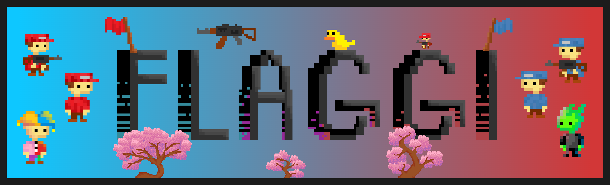

# Flaggi 🚩

_Tournament Tournament Tournament_ submision from [Samuel](https://github.com/Snapshot20) and [Matěj](https://github.com/kireiiiiiiii) for the **RHS Videogame Development Club** It is a Java game compiled using `Java 8` and `Gradle`.

## Game overview

Flaggi is a simple game where two players take turns placing flags on a grid. The objective is to be the first player to collect 3 flags.

## Game installation

Install the latest release of the `Server.jar` and `Flaggi.jar` from the [latest release](https://github.com/kireiiiiiiii/Flaggi/releases/latest). This game is a multiplayer game, requiring a server to run. You can run the server by using the command:

```bash
java -jar Server.jar
```

The server will log (amongst other things) the IP it was creted on. You will need this IP to connect to the server from the client. The client can be run bu using the following command in the directory of the `Flaggi.jar`:

```bash
java -jar Flaggi.jar
```

## Resources

-   [The prompt and specifications given](./public/TTT-game-rules.pdf)
-   [Mindmap mapping the project](./public/TTT.xmind)
-   [Font uses in the banners](https://fonts.google.com/specimen/Ultra)

## Contact

Feel free to create issues or pull requests on the [GitHub repository](https://github.com/kireiiiiiiii/Flaggi). If you have any questions or need further assistance, feel free to reach out to [@\_kireiiiiiiii](https://www.instagram.com/_kireiiiiiiii).
